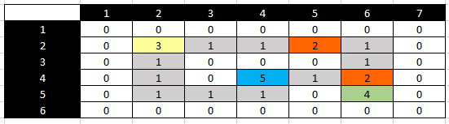

# Problema de Busca - Super Mario Bros
Trabalho da disciplina **SCC0230 - Inteligência Artificial** administrada por Solange Oliveira Rezende.

Projeto para implementação e comparação de Buscas Cegas e Buscas Informadas em contexto de Inteligência Artificial.

## Membros

* Alexandre Eduardo de Souza Jesus - alexandre_souza@usp.br - 12559506

* Arthur Santorum Lorenzetto - arts.lorenzetto@usp.br -

* Eduardo Zaffari Monteiro - eduardozaffarimonteiro@usp.br - 12559490

* Gustavo Silva de Oliveira - gustavo.oliveira03@usp.br - 12567231 (Vice-Líder)

* Lucas Ivars Cadima Ciziks - luciziks@usp.br - 125599472 (Líder)

* Pedro Henrique de Freitas Maçonetto - pedromaconetto@usp.br - 12675419

* Vitor Okubo Ianella - vitorok.03@gmail.com - 

## Introdução

No mundo real, há uma infinidade de questões que podem ser classificadas como **Problemas de Busca**, tais quais a logística de entrega de um produto, o melhor caminho entre duas estações de trem e até mesmo na resolução de jogos. Nesse contexto, é importante compreender as diferentes abordagens e aplicações envolta desses problemas no estudo da Inteligência Artificial. Resumidamente, uma **Busca Cega** ou Não Informada é uma abordagem que não utiliza nenhuma informação adicional além do que definido no problema original, tentando exaustivamente até encontrar a solução ou falhar. Já a **Busca Informada** utiliza uma heurística, algum conhecimento ou informação que auxila nas decisões e torna a busca mais eficiente. Assim, o presente projeto possui como objetivo implementar e comparar os resultados entre algoritmos de Busca Cega e Busca Informada para um mesma problemática em investigação: **O Resgate da Princesa Peach**.

Nesse problema, baseado no mundo fantástico de [Super Mario Bros](https://pt.wikipedia.org/wiki/Super_Mario_Bros.#Enredo), o encanador Mario precisa resgatar a Princesa Peach, raptada pelo vilão Bowser, viajando até sua ardente fortaleza. Em seu caminho, Mario deve enfrentar e derrotar os inimigos que tentarão impedir sua passagem até o castelo. Para isso, Mario precisa comer um **Cogumelo** e assim derrotá-los para finalmente chegar ao castelo e derrotar Bowser. Abstraindo para um problema de busca, Mario começa em um ponto do labirinto (estado inicial) e, antes de chegar ao castelo (estado final), ele precisa comer o **cogumelo** (primeira condição de parada) para derrotar todos os **Goombas** (obstáculos). É importante destacar que antes de comer o cogumelo, os Goombas não permitirão a passagem de Mario.

## Modelagem do Problema

Detalhando o problema apresentado:

* **Estados**: Configuração correnta da matriz esparsa;

* **Operadores**: Mover o Mario uma casa em 4 direções possíveis (Leste, Oeste, Norte ou Sul);

* **Movimentos Válidos**: Não parede / Não Goomba antes do Cogumelo / Goomba após o Cogumelo / Cogumelo / Cogumelo Comido;

* **Configuração Final**: O Cogumelo foi comido, todos os Goombas foram derrotados e o Mario chegou ao Castelo.

* **Custo do Caminho**: Cada movimento tem um custo unitário.

Em nosso processamento, a matriz de entrada contendo o labirinto será um arquivo csv, como a do exemplo utilizado. Visualmente, ela será representada da seguinte forma:

em que:
* 0 representa uma parede;
* 1 é um corredor;
* 2 é um Goomba/inimigo;
* 3 representa o ponto inicial do Mario;
* 4 é o castelo do Bowser (Ponto Final);
* 5 é o cogumelo que fornece poderes ao Mario.